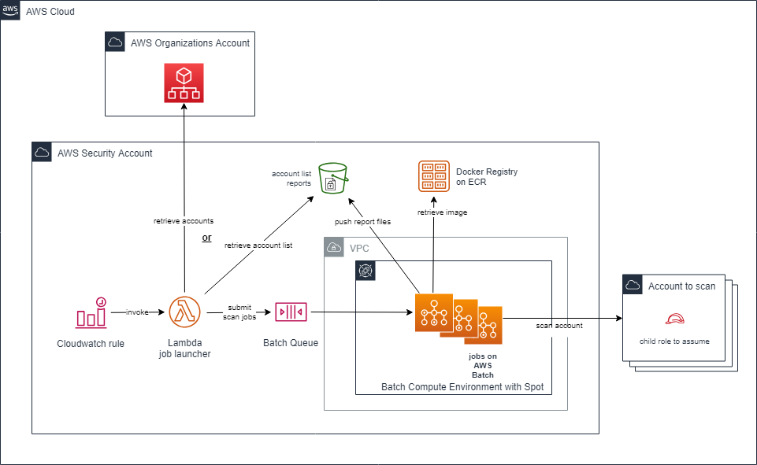

# ScoutSuite Batch

ScoutSuite Batch is an AWS account security scanner specialist based on [ScoutSuite](https://github.com/nccgroup/ScoutSuite) and embeded into AWS Batch jobs.

## Description

People need to audit their account to seek security issues or validate compliance. ScoutSuite Batch is here to do the job for you at a defined frequency.
It ensures cost containment and security hardening.
Reports are stored into an S3 Bucket.

## Technicals details

ScoutSuite batch simply runs [ScoutSuite](https://github.com/nccgroup/ScoutSuite) into AWS Batch jobs.
It simply industrializes the deletion process thanks to the following AWS ressources :
- CloudWatch Rule to trigger the deletion execution
- Batch to ensure a pay per use strategy
- ECR to host the Docker image that embeds aw-nuke
- Lambda to gather the accounts to perform and submit the jobs
- S3 to store generated reports
- Cloudwatch Logs to log the global acitivity

## Prerequisites

ScoutSuite needs :
- a VPC
- a private subnet with Internet connection (through a NAT Gateway)

## Installation

1. deploy the cf-scoutsuite-common.yml Cloudformation stack in the central account
2. Git clone scoutsuite scans into this directory and build, tag and push the Docker image. Follow the information provided in the ECR repository page.
3. deploy the cf-scoutsuite-org-account.yaml in the account using AWS Organizations
4. deploy the cf-scoutsuite-spoke-account.yaml in all the accounts using to scan. To make it easy, use StackSets Stacks from tha Organzations level.
6. deploy the cf-scoutsuite-batch.yml Cloudformation stack in the central account

## How to use it

When installed, no action is needed.

## Extension

It is possible to export ScoutSuite's results into csv files and run Athena on into for large investigations.

